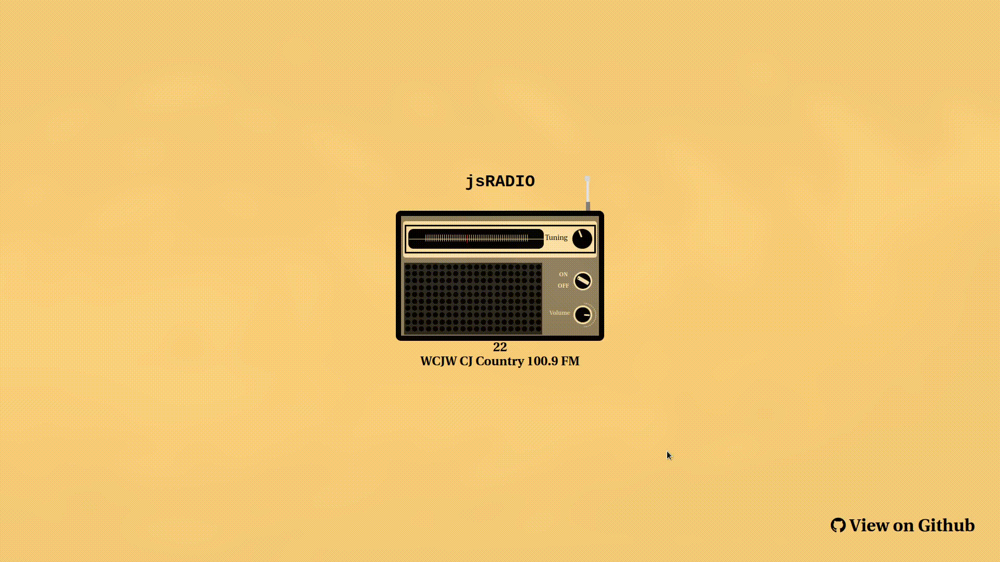

# jsRadio
A Radio Interface to play the top 50 hits from the Radio World API

**Link to project:** https://js-radio.herokuapp.com/

## How It's Made:

**Tech used:** HTML, CSS, JavaScript, Node.js

With all of the different frameworks available to us today, this project was really an exercise for myself and Cornelius to really build our technical skills with the barebones web development tools available to us.

While Cornelius made the radio's UI design, I spent the next couple of weeks giving the radio knobs functionality with user input, adding the radio api to the backend and bringing the whole thing to life using vanilla javascript on both the frontend and backend; no express, no react, just javascript and its environment apis!

With that said I did come across some useful libraries to help with speed up the knob interaction process, so shoutout to [denilsona](https://github.com/denilsonsa) for putting together [html5-xknob](https://github.com/denilsonsa/html5-knob) to make the math easier to get through.

## Updates and Optimizations
x Managed to add a channel buffer functionality that ensures that if you scroll away from your current channel and finish on the same channel after the mouse is released that a query for the web broadcast isn't made.
x Since the api is limited to a very small amount of monthly queries, I decided to handle the api requests on the backend and respond to the client with a json object that includes the list of radio stations. This ensured not only api request were limited but protected the API key from being exposed client-side.

### Future Optimizations
- This project currently only supports radio broadcasts from the US but we will add global support when we have the time to fit in our schedules.
- There is a bug where if the same channel is queried on page refresh. The radio broadcast begins to play two different instances. Will need to sort that out.
- The channel is refreshed, every time the power button is clicked even if it isn't moved, that is a small issue that needs to be fixed.

## Lessons Learned:
The biggest accomplishment so far was getting the small red needle to move in lockstep with the channel knob! It's not often I have opportunities to use algebra in front end development and this was one of those crucial times to calculate the positions correctly and use the results to change the channel.

### Collaborators:
- [Al.exe](https://github.com/alEXE-tech)
- [Cornelius](https://github.com/thecornisians)

### Aknowledgements:
- [denilsona](https://github.com/denilsonsa) - [html5-xknob](https://github.com/denilsonsa/html5-knob)
